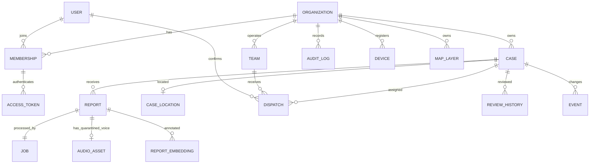

# Database and invariants

Implemented foundation migration: `migrations/versions/0001_foundation.py` plus immutable PostgreSQL-specific SQL snapshot. Future changes require a new revision; do not edit an applied migration. SQLite is unit-test support; PostgreSQL-specific tables/security are tested separately.

Report UUID is client-provided and unique within organisation. Immutable payload hash excludes transport source so an Android-origin report relayed through another channel remains the same report. Original text and reported coordinates remain source data; confirmed case location is a separate human decision. No person/contact directory is collected.

Composite `(tenant_id,id)` foreign keys prevent case/team/report crossing. Tenant-scoped predicates and PostgreSQL FORCE RLS both apply; only the administrative migration/provisioning connection bypasses. `authenticate_token` returns a narrow membership tuple for a digest, with fixed search path. The runtime cannot read token hashes or users directly. Runtime audit/history/event permissions allow INSERT and SELECT, not UPDATE or DELETE.

The case location trigger writes a WGS84 `geography(Point,4326)` row with GiST. Confidence=1 for a human-confirmed coordinate represents confirmation state, not measured geolocation accuracy. pgvector table holds 1024 floats and model revision; weights/inference integration is not yet enabled. No HNSW index before data and recall measurements.

## Transactions and ordering

- Ingress: tenant serialization → UUID lookup → queue quota → case + report + job + audit + event → commit → 202.
- Worker: row claim with lease/fencing token → commit → analysis outside transaction → tenant serialization → verify claim → report annotations and optional untouched case suggestions → event → commit.
- Review/dispatch: tenant serialization → explicit role and version check → mutation + history/audit/event → commit.

Serialising event-producing transactions per tenant avoids a sequence cursor advancing past a still-uncommitted event. It limits single-tenant write throughput: a measured broker/outbox partition design must replace it before claiming high-volume capability. All timestamps are timezone-aware at API boundary; SQLite persistence loses tz metadata, hence does not establish PostgreSQL time semantics.

## Migration and retention

Run migrations with administrator credentials, API/worker with scoped runtime credentials. Back up before production migrations; test forward/backward on disposable databases. Current development downgrade removes schema and must never run on a real incident database. Migrations `0003` and `0004` add reviewed retention plans and expiring legal holds; migration `0005` adds one encrypted, quarantined voice attachment per report, `0006` adds versioned scan/release metadata, and `0007`/`0008` add durable transcript jobs and source provenance. See `docs/security/RETENTION.md`. Backup re-purge and device-cache receipts remain unimplemented; no real PII is used in this foundation.

Migration `0002_case_merge` adds tenant-scoped `merged_into_id`, MERGED status and consistency constraints. Human merge/split preserves original report content, resets review state, and uses optimistic versions under tenant transaction serialization. Downgrade refuses to discard existing merge history. Embeddings remain keyed by tenant/report/model revision; retrieval joins current report case membership so regrouping does not require re-encoding.

Migration `0003_retention_plans` also corrects the spatial trigger: clearing case coordinates now deletes the corresponding `case_locations` geography row. Migration `0004_legal_holds` adds tenant RLS for holds. Downgrades refuse to erase approved/executed plan history or active holds.

Migration `0005_encrypted_audio` stores only bounded WAV metadata, an AES-GCM nonce and ciphertext, a keyed replay digest and a managed key identifier. Migration `0006_audio_scan_release` grants the runtime role updates only to state-machine metadata and adds scanner revision/verdict, optimistic version and human decision fields. `0007_audio_transcripts` creates a forced-RLS lease/retry queue and backfills previously released assets; its audio foreign key cascades retention deletion. `0008_transcript_provenance` records the keyed source-audio digest used for a successful transcript and adds the worker claim index. The root key is environment-provided and HKDF separates encryption and digest keys. There is no public download route. Key rotation, a real isolated scanner and field transcription validation remain future workflows.
