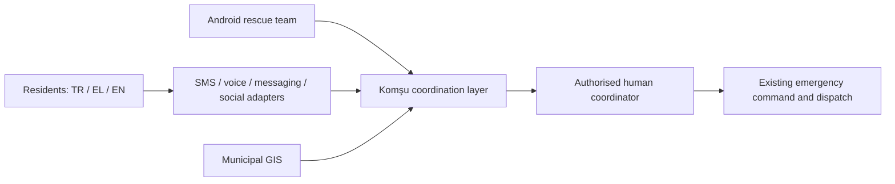
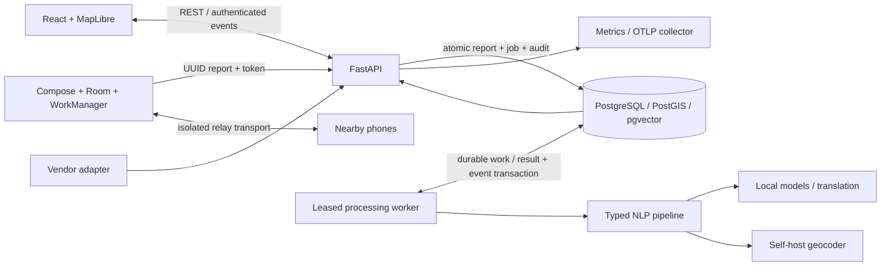
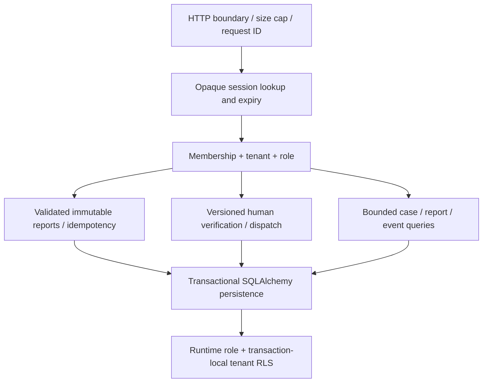

# System architecture

Requirements: FUNC-001..019, EXT-001..021. Status: architecture target with an incremental executable foundation; PROJECT_STATUS states what has been tested.

## Context

## Containers and data flow

## API components

## Invariants

1. Source is immutable during retention. AI annotations and translations are separate, with model/version and warnings.
2. Tenant derives from authenticated server session, never request body. Every lookup scoped; composite foreign keys prevent cross-tenant references. RLS is defence in depth.
3. Ingestion commits report and durable job atomically before 202. UUID replay with same payload returns same report; different payload returns 409. Idempotency applies across source transports. A bounded PCM WAV attachment is stored separately as authenticated ciphertext in tenant RLS and remains quarantined; the API never returns its bytes.
4. Baseline gives suggestions; all new reports immediately exist as reviewable cases even if worker/models fail. No AI code can call dispatch.
5. Human dispatch needs coordinator role, verified case, confirmed location, same-tenant team, matching case version. Conflict never silently overwrites another coordinator.
6. Processing uses claim/lease/attempt state, at-least-once execution and idempotent result application. Model failure does not discard report. DB outage means no false acknowledgement.
7. Event stream is cursor-replayable, bounded and contains IDs/version only. UI fetches authorised details. On disconnect use visible stale state and polling; do not label a stale board live.
8. No unapproved public geocoder receives source data. Ambiguous address stays unlocated until human verification. Map missing does not block list/manual actions.

## Deployment boundaries

First slice uses one Python package with modules and separate API/worker processes, one PostgreSQL durable queue, React client and independent Android app. Do not create seven empty microservices. Optional model weights stay outside source control. Split GPU inference/geocoding processes when latency/throughput measurements justify it. Outbox adapter can move notifications to broker; DB retains authority. Authentication starts with CLI-issued expiring opaque device/operator tokens, hashed at rest; institutional OIDC/PKCE/MFA is a pilot gate.

## Capacity scenarios and failure modes

| Condition | Behaviour | Recovery / evidence required |
|---|---|---|
| 10–100 msg/s normal | bounded ingress, indexed durable queue | measured p50/p95/p99 including database |
| 1000+ sustained | worker batching/partitioning; separate inference; fair tenant quotas | load test on named hardware; no current guarantee |
| 10000/s burst | durable ingress until capacity; 429/503 Retry-After; client retains queue | queue age/disk alarms, drain-rate recovery benchmark |
| API crash | transactions rollback; client reuses UUID | ingest crash/replay test |
| DB failure | readiness fails; writes not acknowledged | encrypted backup restore/PITR drill; failover design |
| Worker/model/geocoder failure | reviewable original case remains; lease/retry/manual warning | outage injection and stuck-lease recovery |
| Duplicate storm | UUID index handles retries; bounded candidate search | semantic storms require human merge, not risky auto-collapse |
| Internet/tile outage | Room persists; map/list show outage; no fake receipt | airplane mode and local map package test |
| WebSocket outage | replay cursor; polling fallback | reconnect and token revocation tests |

Proposed pilot targets (not contractual): API accepted-write p95 <500ms at 100 msg/s; manual case visible <2s; RPO ≤5min and RTO ≤30min only after recovery rehearsal. Alerts on queue age >60s, processing failures, DB readiness, disk and expired backup. No PII in telemetry. Production requires security review, legal sign-off, SLA, 24/7 operations, field validation, certification assessment and official integration agreements.
